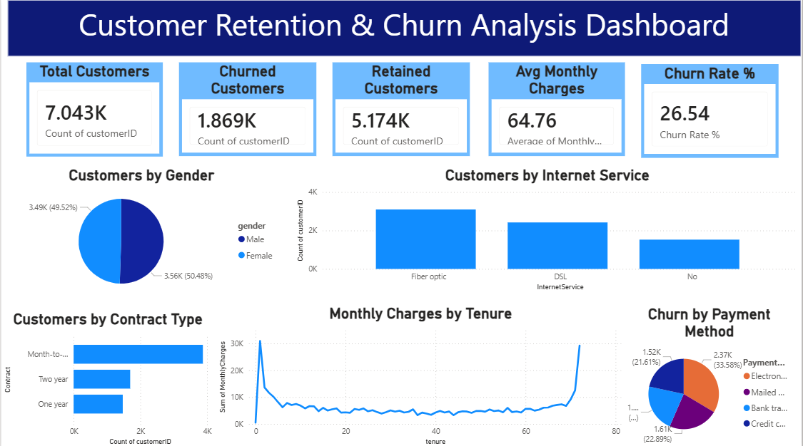

# FUTURE_DS_02

# Customer Retention & Churn Analysis Dashboard

## Project Overview
This project focuses on analyzing customer churn behavior using Power BI and Python. The dashboard helps identify customer retention trends, churn patterns, contract behavior, internet service usage, and payment method analysis.

---

## Tools Used
- Power BI
- Python
- Pandas
- Matplotlib
- Excel / CSV Dataset

---

## Dataset Used
Telco Customer Churn Dataset

---

## Key Features
- Total Customers KPI
- Churned Customers KPI
- Retained Customers KPI
- Average Monthly Charges
- Churn Rate %
- Customer Distribution by Gender
- Internet Service Analysis
- Contract Type Analysis
- Monthly Charges by Tenure
- Churn by Payment Method

---

## Project Structure

```text
FUTURE_DS_02
│
├── dashboard
├── dataset
├── images
├── python
├── screenshots
└── README.md
```

---

## Python Analysis
Python was used for:
- Data analysis
- Chart generation
- Automated graph creation
- Saving visualizations as PNG images

---

## Dashboard Insights
- Month-to-month contracts show higher churn
- Fiber optic customers contribute more to churn
- Electronic check users have higher churn rate
- Long-term customers show better retention

---

## Files Included
- Power BI Dashboard (.pbix)
- Python Analysis Script
- Dataset CSV File
- Dashboard Screenshots
- Generated Charts

---

## Dashboard Preview



---

## Conclusion
This project demonstrates practical business analytics skills using Power BI and Python for customer churn analysis and business decision-making.
